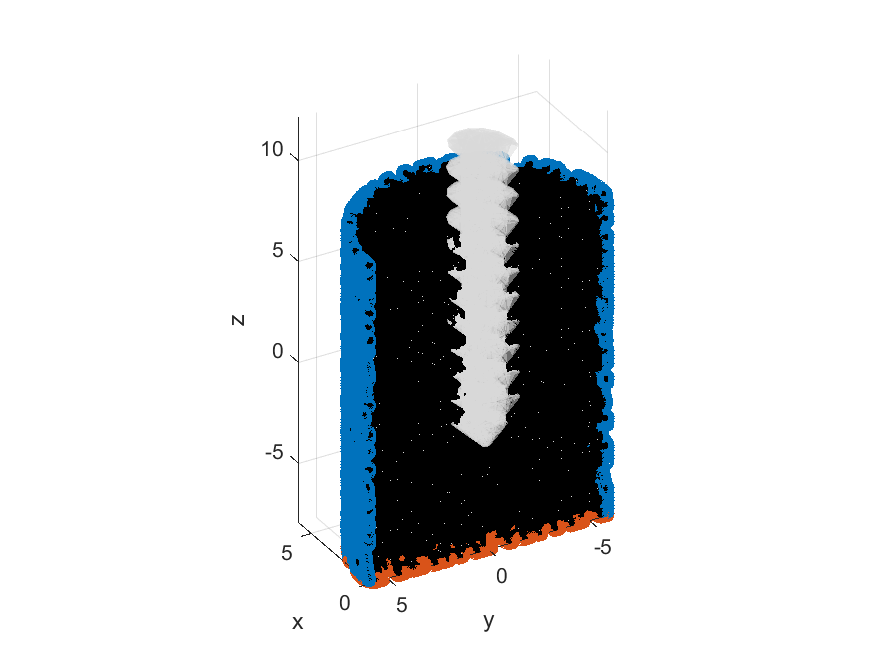
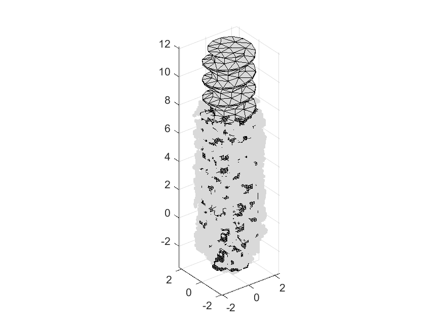
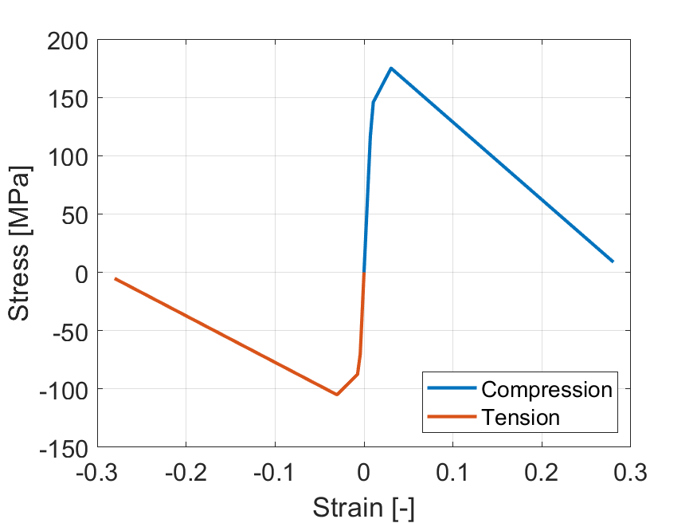

# Bone-Screw Constructs - eFEM

## Introduction
Welcome to the "Bone-Screw Constructs - eFEM" repository! This code is designed for voxel-to-element mesh generation, specifically tailored for evaluating the stability of screw-bone constructs. We have provided several example datasets to get you started, but for more extensive datasets, please visit:

Zhou, Y., Steiner, J. A., Affentranger, R., Persson, C., Ferguson, S. J., van Lenthe, H., & Helgason, B. (2023). Trabecular bone – screw interaction. Micro-CT models and experimental push-in results. (v1.0) [Data set]. Zenodo. https://doi.org/10.5281/zenodo.8405457

If you want to use the code, please cite:
Zhou, Y., Helgason, B., Ferguson, S. J., Persson, C. (2023). Validated, high-resolution, non-linear, explicit finite element models for simulating screw - bone interaction.

## Environment
To use this code, you'll need the following software:
* MATLAB
* ABAQUS (works on 2020/2021, other versions were not tested)

## Example code
Start with testVoxelMeshRF. It will generate a bone-screw construct with the screw digitally inserted into the trabecular bone structure by deleting the overlapped bone element. An ABAQUS keywords file will be generated for eFEM simulation with given boundary conditions, mass scaling factors, and other essential settings.

## Example model

      
    <em> The generated bone-screw construct and boundary conditions. </em>  
      
    <em> The illustration of element digital deletion. </em>  
      
    <em> The illustration of material model CDP. </em>

## Future aspect
* Besides ABAQUS keywords file, we also plan to generate LS-DYNA keywords file
* 

## Acknowledegement
We'd like to acknowledge Jiexian Ma for their contributions to early versions of this code, which were inspired by their work on voxelMesh (voxel-based mesh) available on MATLAB Central File Exchange: voxelMesh (voxel-based mesh) (https://www.mathworks.com/matlabcentral/fileexchange/104720-voxelmesh-voxel-based-mesh), MATLAB Central File Exchange. Retrieved December 13, 2023.
Jiexian Ma's contributions, particularly in the voxel-to-element part, played a significant role in the initial development of this code. Subsequently, we optimized the code by converting loops into matrix calculations, making it more memory-intensive but significantly more efficient for large model generation. Thank you for your valuable contributions!
